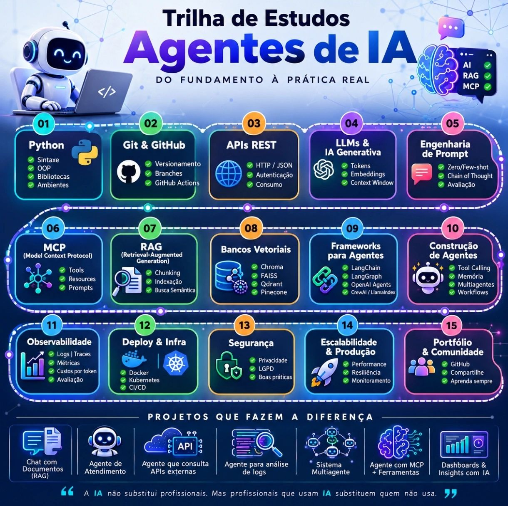

# 🤖 Trilha de Estudos: Agentes de IA — Do Fundamento à Prática Real

  

  
  
  
  

  

  <strong>“A IA não substitui profissionais. Mas profissionais que usam IA substituem quem não usa.”</strong>

---

## 🔍 Sobre a Trilha

Este repositório reúne uma **trilha completa de estudos** para dominar o desenvolvimento de **Agentes de IA**, do zero à produção. Aqui você encontra os **melhores recursos da internet** — vídeos, livros, documentação oficial e cursos — organizados em **5 fases** e **15 módulos**, com projetos práticos e um cronograma sugerido de 16 semanas.

Ideal para desenvolvedores, cientistas de dados e engenheiros que querem se especializar em **LLMs, RAG, MCP, Engenharia de Prompt e frameworks modernos** como LangChain, LangGraph, CrewAI e OpenAI Agents.

### ✨ O que você vai encontrar
- 📚 **Módulos estruturados** com recursos curados (PT-BR e EN)
- 🛠️ **Projetos práticos** para aplicar cada conceito
- 🗓️ **Cronograma sugerido** de 16 semanas
- 🎯 **Foco em portfólio** — o que realmente diferencia no mercado

---

## 🗺️ Visão Geral dos Módulos

| Fase | Módulos | Foco |
|------|---------|------|
| 🟦 **1 — Fundamentos** | 01 Python · 02 Git & GitHub · 03 APIs REST | Base técnica sólida |
| 🟪 **2 — IA Generativa** | 04 LLMs & IA Generativa · 05 Engenharia de Prompt | Entender e domar os modelos |
| 🟧 **3 — Arquitetura de Agentes** | 06 MCP · 07 RAG · 08 Bancos Vetoriais · 09 Frameworks · 10 Construção de Agentes | Construir agentes de verdade |
| 🟩 **4 — Produção** | 11 Observabilidade · 12 Deploy & Infra · 13 Segurança · 14 Escalabilidade | Levar ao mundo real |
| 🟥 **5 — Carreira** | 15 Portfólio & Comunidade | Se destacar no mercado |

> ## 📖 Conteúdo Completo

Todo o conteúdo detalhado da trilha (módulos, recursos, links e práticas) está disponível em:

👉 **[Trilha para Estudos de IA](trilha-para-estudos-de-ia.md)**

---

## 🚀 Como Usar Esta Trilha

1. **Salve a imagem** `trilha-estudos.jpg` como seu mapa mental de referência.
2. **Siga o cronograma** de 16 semanas (ou adapte ao seu ritmo).
3. **Pratique em cada módulo** — a teoria só fixa com código rodando.
4. **Construa os projetos** listados abaixo ao final de cada fase.
5. **Compartilhe seu progresso** com a comunidade e abra PRs com recursos novos!

---

## 📅 Cronograma Sugerido (16 semanas)

| Semanas | Fase | Módulos |
|---------|------|---------|
| 1–3 | Fundamentos | 01, 02, 03 |
| 4–5 | IA Generativa | 04, 05 |
| 6–10 | Arquitetura de Agentes | 06, 07, 08, 09, 10 |
| 11–14 | Produção | 11, 12, 13, 14 |
| 15–16 | Portfólio & Projetos | 15 + Projetos práticos |

---

## 💼 Projetos que Fazem a Diferença

| # | Projeto | Tecnologias |
|---|---------|-------------|
| 1 | **Chat com Documentos (RAG)** | LangChain + ChromaDB + OpenAI |
| 2 | **Agente de Atendimento** | CrewAI + Tool Calling + Memória |
| 3 | **Agente que consulta APIs externas** | Function Calling + FastAPI |
| 4 | **Agente para análise de logs** | LangChain + Pandas + LLM |
| 5 | **Sistema Multiagente** | LangGraph ou AutoGen |
| 6 | **Agente com MCP + Ferramentas** | MCP Server + Anthropic Claude |
| 7 | **Dashboards & Insights com IA** | Streamlit + LLM + Gráficos |

---

## 🤝 Como Contribuir

Contribuições são **muito bem-vindas**! Conhece um curso, livro, artigo ou vídeo incrível que ficou de fora? Manda ver:

1. Faça um **fork** do repositório: [davidsonsilva/trilha-estudos-ia](https://github.com/davidsonsilva/trilha-estudos-ia)
2. Crie uma branch com sua sugestão: `git checkout -b feature/novo-recurso`
3. Commit suas mudanças: `git commit -m 'Adiciona recurso X no módulo Y'`
4. Push para a branch: `git push origin feature/novo-recurso`
5. Abra um **Pull Request** 🚀

Também vale abrir uma **Issue** com sugestões, correções ou dúvidas.

---

## 📜 Licença

Este projeto está licenciado sob a [MIT License](https://github.com/davidsonsilva/trilha-estudos-ia/blob/main/LICENSE).

---

## 🔗 Links Úteis

- 📦 **Repositório:** [github.com/davidsonsilva/trilha-estudos-ia](https://github.com/davidsonsilva/trilha-estudos-ia)
- 🐛 **Issues:** [github.com/davidsonsilva/trilha-estudos-ia/issues](https://github.com/davidsonsilva/trilha-estudos-ia/issues)
- ⭐ **Deixe uma estrela** se este conteúdo te ajudar!

---

  Feito com ☕ e curiosidade por <a href="https://github.com/davidsonsilva">@davidsonsilva</a>

  <em>“A IA não substitui profissionais. Mas profissionais que usam IA substituem quem não usa.”</em>

